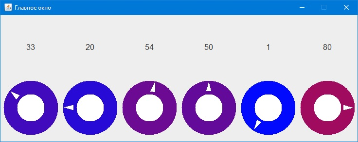

# SimpleSwingComponent
Данный проект - попытка создать простой компонент Swing и продемонстрировать пример его использования.
Компонент представляет собой круговой регулятор, имитирующий регуляторы, к примеру, аудиоаппаратуры.
Положение регулятора можно изменять с помощью колёсика мыши или с помощью щелчка левой кнопкой.
Цвет регулятора меняется в зависимости от выбранного значения от синего (минимальное значение) до красного (максимальное)
Также реализованы классы событий и слушателей для компонента.

В форму (на скриншоте ниже) добавлено несколько таких компонентов с различными положениями регулятора. Связанная с компонентом метка JLabel отображает значение поля value, соответствующее положению регулятора.

